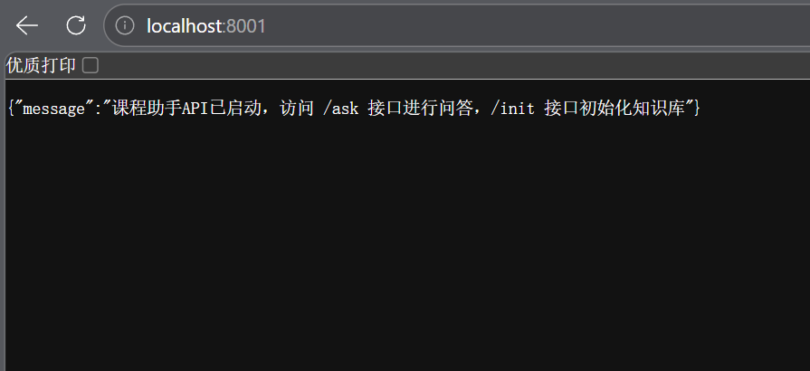
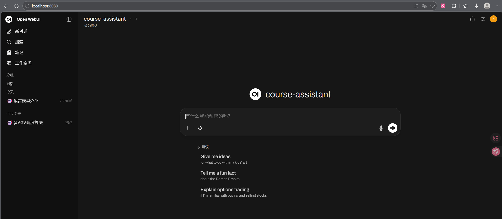
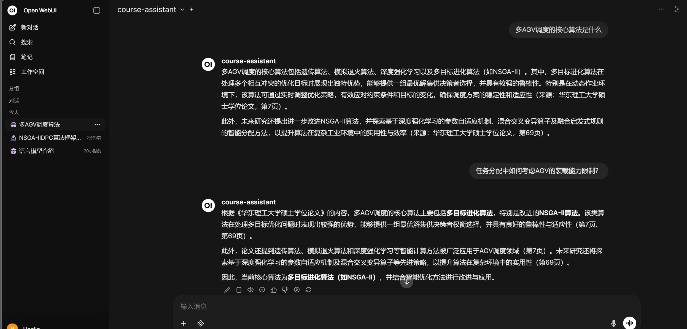

# 智能课程助手
基于 RAG（检索增强生成）技术的智能问答系统，帮助学生快速查询课程资料中的内容。

## 项目简介
智能课程助手是一个 AI 驱动的问答系统，能够从课程 PDF 资料中检索相关信息并生成准确回答。系统采用前后端分离架构，后端使用 FastAPI + LangChain 构建 RAG 服务，前端支持多种使用方式：
1. Gradio 提供友好的 Web 界面
2. 本地安装 Open WebUI
3. 原生开发（HTML + CSS + JavaScript）（web/ 文件夹）。

## 技术栈
| 组件     | 技术选型                     |
| ------ | ------------------------ |
| 后端框架   | FastAPI                  |
| RAG 框架 | LangChain                |
| 向量数据库  | FAISS（本地存储）              |
| 大语言模型  | 阿里云百炼 qwen-plus          |
| 嵌入模型   | 阿里云百炼 text-embedding-v2  |
| 前端界面   | Gradio / OpenWebUI /原生界面 |

## 项目结构
```
├── backend/                    # 后端服务
│   ├── main.py                # FastAPI 主服务
│   ├── knowledge_base.py      # 知识库构建模块
│   ├── qa_chain.py            # 问答链模块
│   └── requirements.txt       # Python 依赖
├── frontend/                   # 前端服务
│   ├── app.py                 # Gradio Web 界面
│   └── requirements.txt       # Python 依赖
├── course_materials/           # 课程资料存放目录（不存在需手动创建）
│   └── *.pdf                  # PDF 课程文件
├── course_knowledge_base/      # 向量库存储目录（自动生成）
│   ├── index.faiss        # FAISS 索引文件
│   └── index.pkl          # FAISS 元数据文件
├── DEPLOYMENT_GUIDE.md         # 详细部署指南
├── web/                        # 原生前端界面代码
├── solve.txt                   # 问题解决记录
└── README.md                   # 项目说明文档
```

## 快速开始

### 环境要求
- Python 3.10+
- 阿里云百炼平台 API 密钥

### 安装步骤
1. **克隆项目**
```bash
git clone <repository-url>
cd 你的文件目录
```

2. **安装后端依赖**
```bash
cd backend
pip install -r requirements.txt
```

3. **安装前端依赖**
```bash
cd ../frontend
pip install -r requirements.txt
```

4. **配置环境变量**
```bash
# Windows
set BAILIAN_API_KEY=你的百炼平台API密钥

# Linux/Mac
export BAILIAN_API_KEY=你的百炼平台API密钥
```
或者使用 `.env` 文件

5. **准备课程资料**
将 PDF 格式的课程资料放入 `course_materials` 文件夹（如果不存在请创建）。

6. **启动后端服务**
```bash
cd backend
python main.py
```
后端服务将在 http://localhost:8001 运行。  


7. **初始化知识库（首次使用或新增课程资料时）**
```bash
# 使用 PowerShell
Invoke-WebRequest -Uri "http://localhost:8001/init" -Method POST

# 或使用 curl
curl -X POST http://localhost:8001/init
```

8. **启动前端界面**

   a. **使用 Gradio Web 界面（推荐，快速验证）**
   ```bash
   cd frontend
   python app.py
   ```
   前端界面将在 http://localhost:7860 运行。

     b. **使用 Open WebUI**  
     使用 Open WebUI 访问。参阅 [DEPLOYMENT_GUIDE.md](./docs/DEPLOYMENT_GUIDE.md)。  
     

     c. **使用原生前端界面**  
     使用原生前端界面访问1. 用浏览器打开 d:\你的文件目录\web\index.html  
     或启动本地服务器：  
     ```bash
     cd 你的文件目录\web
     python -m http.server 8080
     ```
     然后访问 http://localhost:8080  

## API 接口

| 接口                     | 方法   | 说明              |
| ---------------------- | ---- | --------------- |
| `/`                    | GET  | 服务信息            |
| `/health`              | GET  | 健康检查            |
| `/ask`                 | POST | 问答接口            |
| `/init`                | POST | 初始化/重建知识库       |
| `/v1/models`           | GET  | 返回可用模型列表（OpenAI兼容）  |
| `/v1/chat/completions` | POST | 处理OpenAI格式的聊天请求（OpenAI兼容） |

### 问答示例

```bash
# PowerShell
curl -X POST http://localhost:8001/ask -H "Content-Type: application/json" -d '{"question": "什么是多AGV调度算法？"}'

# CMD
curl -X POST http://localhost:8001/ask -H "Content-Type: application/json" -d "{\"question\":\"什么是多AGV调度算法？\"}"
# Windows cmd.exe 中，JSON 数据应该用 双引号 包裹，并且内部的双引号需要转义
```
OpenWebUI 界面示例：  
  
根据知识库回答并给出来源  

### 初始化知识库

```bash
# 初始化知识库
curl -X POST http://localhost:8001/init

# 强制重建知识库（当你放入新的文件时）
curl -X POST http://localhost:8001/init?force_rebuild=true
```

## 功能特性

- **智能问答**：基于课程资料进行精准问答，回答有据可依
- **知识库管理**：支持知识库初始化和重建
- **批量处理**：支持批量加载 PDF 文件构建向量库
- **多界面选择**：Gradio / Open WebUI / 原生API
- **OpenAI兼容**：提供OpenAI兼容API，支持Open WebUI等客户端
- **服务监控**：提供健康检查接口
- **CORS支持**：已配置跨域支持，允许所有来源访问

## 工作原理

```
用户提问 → 文本嵌入 → 向量检索 → 上下文组装 → LLM生成 → 返回答案
              ↓
         FAISS向量库
              ↑
    PDF文档 → 文本分割 → 向量化 → 存储
```

1. **文档处理**：使用 PyPDFLoader 加载 PDF，RecursiveCharacterTextSplitter 分割文本
2. **向量化**：调用百炼平台嵌入模型将文本转换为向量
3. **存储**：使用 FAISS 本地向量数据库存储
4. **检索**：基于语义相似度检索相关文档片段
5. **生成**：LLM 基于检索内容生成回答

## 详细文档

详细的部署和使用说明请参阅 [DEPLOYMENT_GUIDE.md](./docs/DEPLOYMENT_GUIDE.md)。

## 常见问题

需要重建知识库的情况 ：
- 新增/删除/修改了 PDF 文件
- 更换了嵌入模型
- 修改了文本分割参数（chunk_size, chunk_overlap）

如有问题，请查看 [DEPLOYMENT_GUIDE.md](./docs/DEPLOYMENT_GUIDE.md) 中的常见问题部分，或查看 [solve.txt](./docs/solve.txt) 中的问题解决记录。

## 注意事项

- 确保 `BAILIAN_API_KEY` 环境变量已正确设置
- 课程资料变更后需调用 `/init` 接口重建知识库
- 向量库文件存储在 `course_knowledge_base` 目录
- Open WebUI在conda环境运行，后端在全局环境运行是可以的，它们通过网络端口通信

## License

MIT
